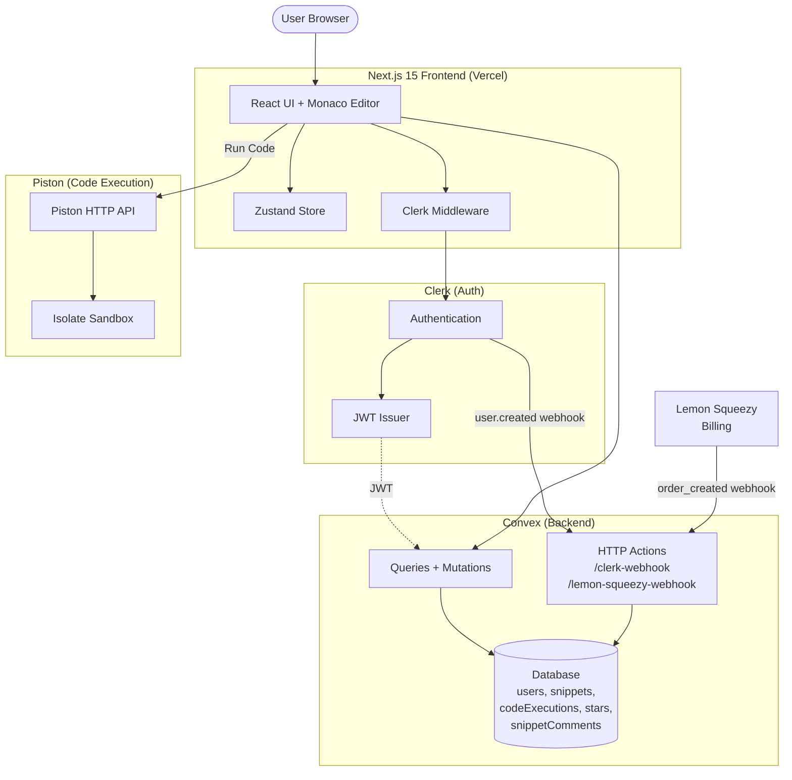
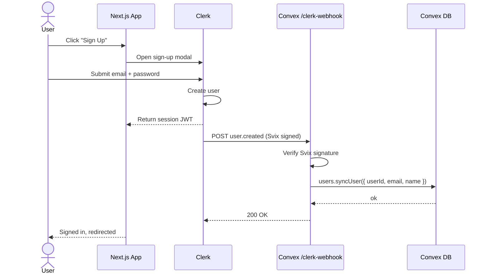
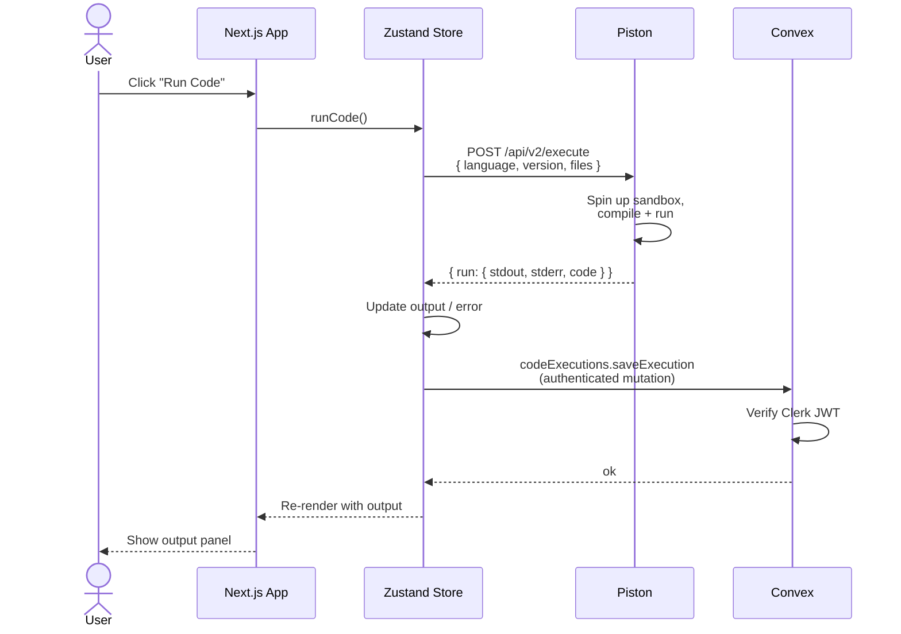
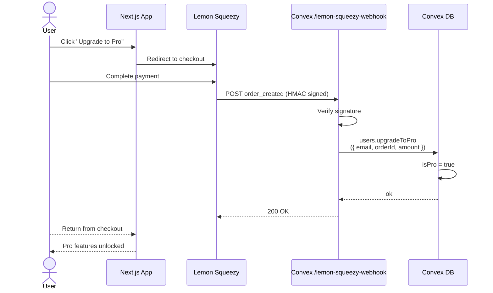
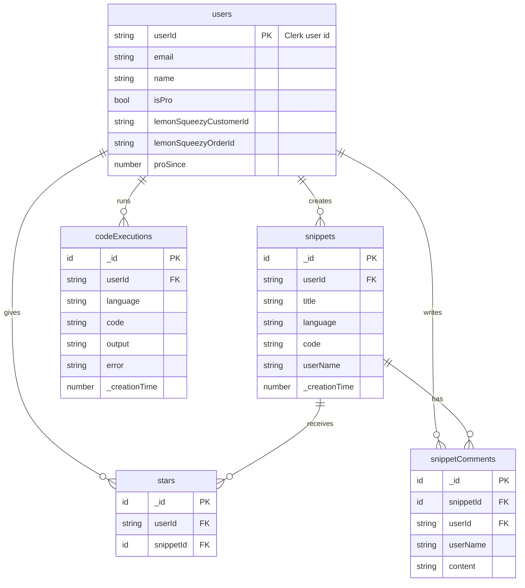
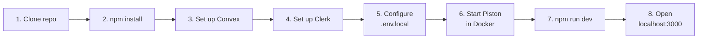
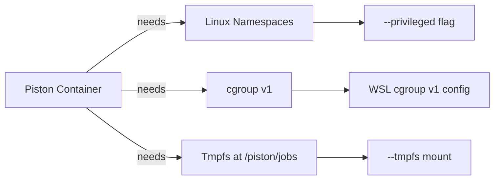
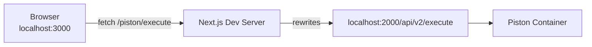
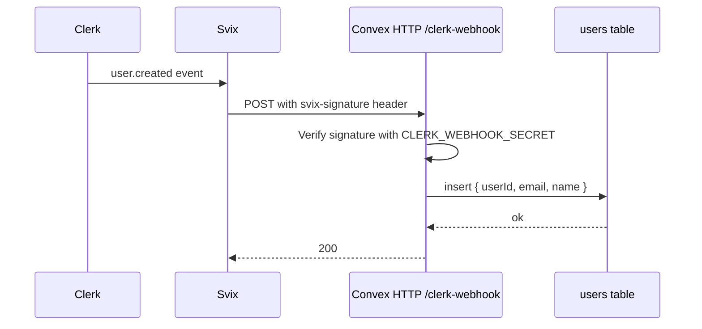
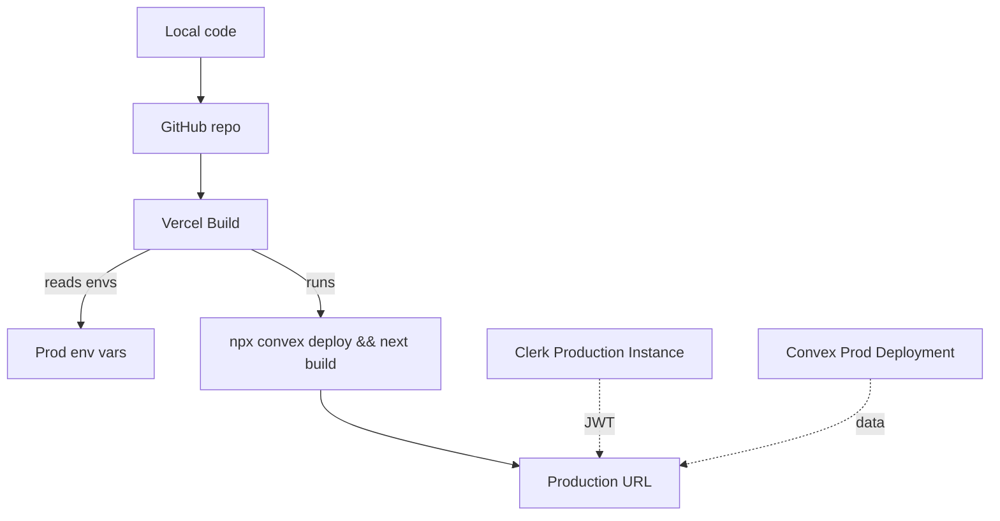

<h1 align="center">CodeCraft — SaaS Code Editor</h1>

<p align="center">
  An online multi-language IDE built with Next.js 15, Convex, and Clerk.<br/>
  Write, run, save, and share code snippets in 10+ languages.
</p>

---

## Table of Contents

1. [Features](#features)
2. [Tech Stack](#tech-stack)
3. [Architecture Overview](#architecture-overview)
4. [Request Flow Diagrams](#request-flow-diagrams)
5. [Data Model](#data-model)
6. [Prerequisites](#prerequisites)
7. [Local Setup](#local-setup)
8. [Environment Variables Reference](#environment-variables-reference)
9. [Running Piston Locally (Code Execution Engine)](#running-piston-locally-code-execution-engine)
10. [Clerk Webhook Setup](#clerk-webhook-setup)
11. [Production Deployment to Vercel](#production-deployment-to-vercel)
12. [Project Structure](#project-structure)
13. [Troubleshooting](#troubleshooting)
14. [FAQ](#faq)

---

## Features

- Online IDE with **10 languages**: JavaScript, TypeScript, Python, Java, Go, Rust, C++, C#, Ruby, Swift
- **5 VS Code themes** (VS Dark, VS Light, GitHub Dark, Monokai, Solarized Dark)
- **Smart output panel** with success / error states and stderr capture
- **Free & Pro plans** via Lemon Squeezy billing
- **Community sharing**: publish snippets, comment, star
- **Advanced filtering & search** across public snippets
- **User profile** with execution history + statistics dashboard
- **Font size controls** and UI customization
- **Webhook-driven user sync** (Clerk → Convex)

---

## Tech Stack

| Layer | Technology | Purpose |
|---|---|---|
| Framework | **Next.js 15** (App Router) | SSR, routing, API routes |
| Language | **TypeScript** | Type safety |
| Backend/DB | **Convex** | Realtime database + serverless functions |
| Auth | **Clerk** | Sign-in, sign-up, user management |
| Editor | **Monaco Editor** | The editor that powers VS Code |
| Code Exec | **Piston API** | Sandboxed multi-language code execution |
| Billing | **Lemon Squeezy** | Pro plan payments |
| State | **Zustand** | Client-side store |
| Styling | **Tailwind CSS** | Utility-first styling |
| Animation | **Framer Motion** | UI transitions |

---

## Architecture Overview



---

## Request Flow Diagrams

### Flow 1: User signs up



### Flow 2: User runs code



### Flow 3: User upgrades to Pro



---

## Data Model



---

## Prerequisites

Install these before starting:

| Tool | Version | Why |
|---|---|---|
| [Node.js](https://nodejs.org) | 18+ | Run Next.js |
| [Git](https://git-scm.com) | latest | Version control |
| [Docker Desktop](https://www.docker.com/products/docker-desktop) | latest | Run Piston locally |
| A [Clerk](https://clerk.com) account | free | Auth |
| A [Convex](https://convex.dev) account | free | Backend |
| (Optional) [Lemon Squeezy](https://lemonsqueezy.com) | free to sign up | Billing |

---

## Local Setup



### 1. Clone and install

```bash
git clone https://github.com/YOUR_USERNAME/code-craft.git
cd code-craft
npm install --legacy-peer-deps
```

> **Why `--legacy-peer-deps`?** The project uses a React 19 RC. Some dependencies (like `@monaco-editor/react`) only declare support for React 18 in their peer deps. They work fine at runtime — this flag tells npm to skip the strict check.

### 2. Set up Convex

```bash
npx convex dev
```

This command will:
- Prompt you to log in / sign up on Convex
- Ask you to create a new project (name it `code-craft` or anything)
- Write `CONVEX_DEPLOYMENT` and `NEXT_PUBLIC_CONVEX_URL` into `.env.local`
- Deploy the functions in `convex/` to your dev deployment
- Keep watching for changes (leave this terminal running)

### 3. Set up Clerk

1. Go to https://dashboard.clerk.com and create a new application.
2. Choose sign-in methods (Email + Google works well).
3. Go to **API Keys** — copy:
   - `NEXT_PUBLIC_CLERK_PUBLISHABLE_KEY` (starts `pk_test_...`)
   - `CLERK_SECRET_KEY` (starts `sk_test_...`)
4. Go to **JWT Templates** → **New template** → choose **Convex**
   - Name it exactly `convex` (case-sensitive)
   - Copy the **Issuer URL** (looks like `https://your-app-xx-xx.clerk.accounts.dev`)
5. Update `convex/auth.config.ts` — replace the `domain` with your Issuer URL:
   ```ts
   export default {
     providers: [
       {
         domain: "https://your-app-xx-xx.clerk.accounts.dev/",
         applicationID: "convex",
       },
     ],
   };
   ```
6. Convex will auto-redeploy the next time you save.

### 4. Configure `.env.local`

Open `.env.local` (already partially populated by `npx convex dev`) and add the Clerk keys:

```env
# Convex — added automatically by `npx convex dev`
CONVEX_DEPLOYMENT=dev:your-deployment-name
NEXT_PUBLIC_CONVEX_URL=https://your-deployment.convex.cloud

# Clerk — get these from dashboard.clerk.com > API Keys
NEXT_PUBLIC_CLERK_PUBLISHABLE_KEY=pk_test_xxxxxxxxxxxx
CLERK_SECRET_KEY=sk_test_xxxxxxxxxxxx
```

### 5. Start Piston (see next section)

### 6. Run the app

```bash
npm run dev
```

Open http://localhost:3000.

---

## Environment Variables Reference

### `.env.local` (Next.js)

| Variable | Where to get it | Used by |
|---|---|---|
| `CONVEX_DEPLOYMENT` | Auto-set by `npx convex dev` | Convex CLI |
| `NEXT_PUBLIC_CONVEX_URL` | Auto-set by `npx convex dev` | Frontend |
| `NEXT_PUBLIC_CLERK_PUBLISHABLE_KEY` | Clerk dashboard → API Keys | Frontend |
| `CLERK_SECRET_KEY` | Clerk dashboard → API Keys | Next.js server routes |
| `NEXT_PUBLIC_PISTON_URL` | (optional) URL of your hosted Piston instance | Frontend |

### Convex environment (set with `npx convex env set`)

| Variable | Where to get it | Used by |
|---|---|---|
| `CLERK_WEBHOOK_SECRET` | Clerk dashboard → Webhooks → signing secret | `convex/http.ts` |
| `LEMON_SQUEEZY_WEBHOOK_SECRET` | Lemon Squeezy dashboard → Webhooks | `convex/http.ts` |

---

## Running Piston Locally (Code Execution Engine)

The app relies on [Piston](https://github.com/engineer-man/piston) — an open-source sandboxed code execution engine — to run user code. The **public Piston API at emkc.org became whitelist-only on Feb 15, 2026**, so you must self-host.

### Why Piston needs special flags



### Setup on Windows (Docker Desktop + WSL2)

**1. Force WSL to use cgroup v1**

Create `C:\Users\<you>\.wslconfig`:

```ini
[wsl2]
kernelCommandLine=cgroup_no_v1=never systemd.unified_cgroup_hierarchy=0
```

Then:

```powershell
wsl --shutdown
```

Quit Docker Desktop from the tray and re-open it.

**2. Run Piston**

```powershell
docker run -d --privileged --name piston_api -p 2000:2000 --tmpfs /piston/jobs:exec,uid=1000,gid=1000,mode=711 ghcr.io/engineer-man/piston
```

**3. Verify it's running**

```powershell
docker logs piston_api
# Expected: "API server started on 0.0.0.0:2000"

docker ps
# Expected: piston_api status "Up"
```

**4. Install language runtimes** (pick the ones you'll use)

```powershell
curl.exe -X POST http://localhost:2000/api/v2/packages -H "Content-Type: application/json" -d "{\"language\":\"node\",\"version\":\"18.15.0\"}"
curl.exe -X POST http://localhost:2000/api/v2/packages -H "Content-Type: application/json" -d "{\"language\":\"python\",\"version\":\"3.10.0\"}"
curl.exe -X POST http://localhost:2000/api/v2/packages -H "Content-Type: application/json" -d "{\"language\":\"typescript\",\"version\":\"5.0.3\"}"
curl.exe -X POST http://localhost:2000/api/v2/packages -H "Content-Type: application/json" -d "{\"language\":\"java\",\"version\":\"15.0.2\"}"
curl.exe -X POST http://localhost:2000/api/v2/packages -H "Content-Type: application/json" -d "{\"language\":\"go\",\"version\":\"1.16.2\"}"
curl.exe -X POST http://localhost:2000/api/v2/packages -H "Content-Type: application/json" -d "{\"language\":\"rust\",\"version\":\"1.68.2\"}"
curl.exe -X POST http://localhost:2000/api/v2/packages -H "Content-Type: application/json" -d "{\"language\":\"c++\",\"version\":\"10.2.0\"}"
curl.exe -X POST http://localhost:2000/api/v2/packages -H "Content-Type: application/json" -d "{\"language\":\"csharp\",\"version\":\"6.12.0\"}"
curl.exe -X POST http://localhost:2000/api/v2/packages -H "Content-Type: application/json" -d "{\"language\":\"ruby\",\"version\":\"3.0.1\"}"
curl.exe -X POST http://localhost:2000/api/v2/packages -H "Content-Type: application/json" -d "{\"language\":\"swift\",\"version\":\"5.3.3\"}"
```

**5. Verify installed runtimes**

```powershell
curl.exe http://localhost:2000/api/v2/runtimes
```

### How the app talks to Piston



The rewrite in `next.config.ts` avoids CORS by making the browser call same-origin:

```ts
async rewrites() {
  return [
    {
      source: "/piston/:path*",
      destination: "http://localhost:2000/api/v2/:path*",
    },
  ];
}
```

---

## Clerk Webhook Setup

The webhook syncs users from Clerk into the Convex `users` table when they sign up.



### Steps

1. In your Convex dashboard, find your **HTTP Actions URL** (Health page) — looks like `https://your-deployment.convex.site`.
2. In Clerk dashboard → **Webhooks** → **Add Endpoint**:
   - **URL**: `https://your-deployment.convex.site/clerk-webhook`
   - **Events**: check `user.created` (also `user.updated`, `user.deleted` optionally)
3. After creating, click the endpoint → **Signing Secret** → **Reveal** → copy it.
4. In your project terminal:
   ```bash
   npx convex env set CLERK_WEBHOOK_SECRET whsec_your_secret_here
   ```
5. Test: in Clerk dashboard → Webhooks → **Testing** tab → send a test `user.created`. Should return **200**.

---

## Production Deployment to Vercel

### Overview



### Note about Run Code in production

Self-hosting Piston requires a VPS with privileged Docker (e.g. Hetzner, DigitalOcean, Linode). **Managed platforms like Vercel, Railway, and Render do NOT support privileged containers** — so you cannot host Piston on them.

This deployment guide uses the "**Option C**" approach: ship to Vercel, accept that Run Code will fail in production until you host Piston on a VPS. Every other feature (auth, save snippets, browse, star, comment) works.

Later, once you have a Piston URL, set `NEXT_PUBLIC_PISTON_URL=https://your-piston-host/api/v2/execute` in Vercel and Run Code starts working.

### 1. Push to GitHub

```bash
git init
git add .
git commit -m "Initial commit"
git remote add origin https://github.com/YOUR_USERNAME/code-craft.git
git branch -M main
git push -u origin main
```

### 2. Create a Convex production deployment

```bash
npx convex deploy
```

Save the output — it gives you:
- A production deployment URL
- A production `NEXT_PUBLIC_CONVEX_URL`

Also get a **Deploy Key** from Convex dashboard → Settings → **Deploy Keys** → Generate.

### 3. Create a Clerk Production Instance

In Clerk dashboard → top-left dropdown → **Create production instance**.

Repeat JWT template setup in prod:
- **JWT Templates** → **New template** → Convex → name it `convex`
- Copy the new Issuer URL

Update `convex/auth.config.ts` to accept both dev and prod issuers:

```ts
export default {
  providers: [
    {
      domain: "https://your-app-xx-xx.clerk.accounts.dev/",
      applicationID: "convex",
    },
    {
      domain: "https://clerk.yourdomain.com/",
      applicationID: "convex",
    },
  ],
};
```

### 4. Import into Vercel

1. Go to https://vercel.com/new.
2. Import your GitHub repo.
3. In the import step, set these **Environment Variables**:

| Name | Value |
|---|---|
| `NEXT_PUBLIC_CONVEX_URL` | Your prod Convex URL |
| `CONVEX_DEPLOY_KEY` | From Convex dashboard → Deploy Keys |
| `NEXT_PUBLIC_CLERK_PUBLISHABLE_KEY` | `pk_live_...` from Clerk prod |
| `CLERK_SECRET_KEY` | `sk_live_...` from Clerk prod |

4. **Build & Output Settings**:
   - **Build Command**: `npx convex deploy --cmd 'npm run build'`
   - **Install Command**: `npm install --legacy-peer-deps`

5. Click **Deploy**.

### 5. Set up production webhooks

After Vercel gives you a URL:

1. In **Clerk production** → Webhooks → add endpoint pointing at `https://your-prod-convex.convex.site/clerk-webhook`.
2. Copy the signing secret.
3. Set it on prod Convex:
   ```bash
   npx convex env set --prod CLERK_WEBHOOK_SECRET whsec_...
   ```

### 6. (Later) Point Run Code at a hosted Piston

When you're ready to enable code execution in production:

1. Rent a VPS (Hetzner CX11 is ~$4/mo).
2. SSH in, install Docker, run:
   ```bash
   docker run -d --privileged --name piston_api -p 2000:2000 --tmpfs /piston/jobs:exec,uid=1000,gid=1000,mode=711 ghcr.io/engineer-man/piston
   ```
3. Install languages (same curl commands as local setup).
4. Open port 2000 in firewall.
5. In Vercel → Project Settings → Environment Variables, add:
   ```
   NEXT_PUBLIC_PISTON_URL=http://your-vps-ip:2000/api/v2/execute
   ```
6. Redeploy.

---

## Project Structure

```
code-craft/
├── convex/                        # Convex backend
│   ├── _generated/                # auto-generated types & API
│   ├── auth.config.ts             # Clerk JWT config
│   ├── codeExecutions.ts          # save + query user's run history
│   ├── http.ts                    # Clerk + Lemon Squeezy webhooks
│   ├── lemonSqueezy.ts            # payment verification
│   ├── schema.ts                  # database schema
│   ├── snippets.ts                # CRUD for shared snippets
│   └── users.ts                   # syncUser, upgradeToPro
│
├── src/
│   ├── app/                       # Next.js App Router
│   │   ├── (root)/                # main editor page
│   │   ├── pricing/               # Pro plan checkout
│   │   ├── profile/               # user profile + history
│   │   ├── snippets/              # browse community snippets
│   │   └── layout.tsx             # root layout + ClerkProvider
│   ├── components/                # shared React components
│   ├── hooks/                     # custom hooks
│   ├── store/
│   │   └── useCodeEditorStore.ts  # Zustand global state
│   ├── types/                     # shared TS types
│   └── middleware.ts              # Clerk auth middleware
│
├── public/                        # static assets
├── .env.local                     # local env vars (gitignored)
├── next.config.ts                 # Next.js config + Piston rewrite
├── package.json
└── README.md
```

---

## Troubleshooting

### `npm install` fails with ERESOLVE

Use `npm install --legacy-peer-deps`. The project uses React 19 RC which trips some peer dep checks.

### `Not authenticated` error when running code

- Make sure Clerk JWT template is named exactly `convex` (case-sensitive).
- Make sure `convex/auth.config.ts` `domain` matches your Clerk Issuer URL.
- Restart `npx convex dev` after changing `auth.config.ts`.
- Sign out and sign in again (old JWTs are cached).

### Piston container exits immediately with `mkdir: Read-only file system`

- WSL2 is on cgroup v2. Follow the `.wslconfig` step in [Running Piston Locally](#running-piston-locally-code-execution-engine).
- Restart WSL: `wsl --shutdown` and restart Docker Desktop.

### Piston container exits with `chown: /piston: No such file or directory`

- You mounted `/sys/fs/cgroup` as a volume. Remove that mount; use only `--privileged` and `--tmpfs /piston/jobs:...`.

### Run Code shows "Error running code" but Piston logs look fine

- Almost always CORS. Make sure you're using the `/piston/execute` URL in the fetch (not `http://localhost:2000` directly).
- Make sure `next.config.ts` has the `rewrites()` function.
- Restart `npm run dev` after editing `next.config.ts` — rewrites don't hot-reload.

### Clerk webhook returns 401

- Wrong signing secret. Re-copy from Clerk dashboard and run `npx convex env set CLERK_WEBHOOK_SECRET whsec_...` again.

### Clerk webhook returns 404

- URL is wrong. Must end in `/clerk-webhook` and use `.convex.site` (not `.convex.cloud`).

---

## FAQ

**Q: Why does Run Code work locally but not in production?**
A: Piston needs a privileged Docker container to run its sandbox. Vercel/Railway/Render don't support privileged containers. You need a VPS. See the "Point Run Code at a hosted Piston" step in the deployment section.

**Q: Can I use a different code execution service?**
A: Yes — Judge0 on RapidAPI is a common alternative. You'd rewrite the `fetch` call in `src/store/useCodeEditorStore.ts` to use Judge0's API format + add an API key. Free tier is 50 requests/day.

**Q: Do I have to install all 10 language runtimes in Piston?**
A: No. Install only the ones you'll actually test. Each is independent.

**Q: Installed languages disappear after `docker rm`. How do I persist them?**
A: Mount a named volume for `/piston/packages`:
```bash
docker run -d --privileged --name piston_api -p 2000:2000 \
  -v piston_packages:/piston/packages \
  --tmpfs /piston/jobs:exec,uid=1000,gid=1000,mode=711 \
  ghcr.io/engineer-man/piston
```

**Q: Is Lemon Squeezy required?**
A: No — if you don't set up Lemon Squeezy, the Upgrade button won't work but the rest of the app runs fine. Skip the `LEMON_SQUEEZY_WEBHOOK_SECRET` step.

